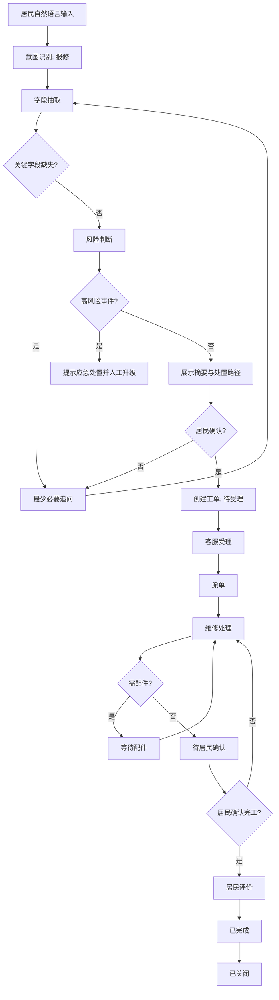
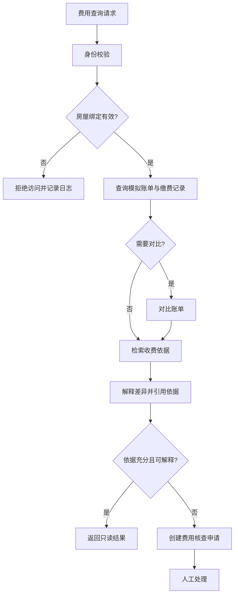
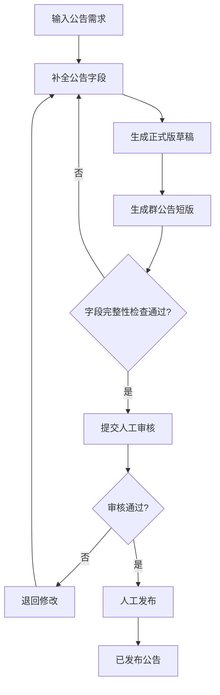
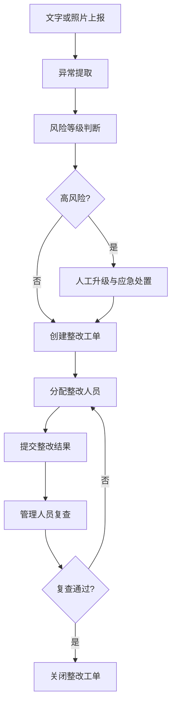
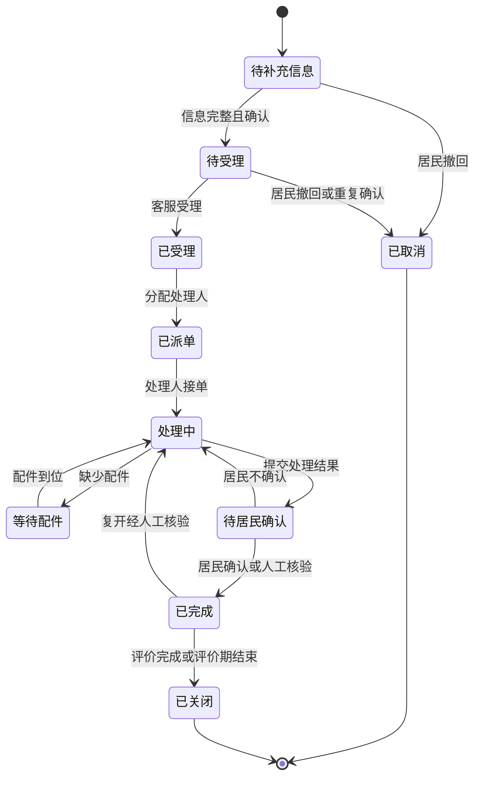

# 02 业务流程与状态机

## 一、居民报修工单闭环

关键字段为位置、故障现象、联系方式；设备、影响范围和图片按类别或风险补充。电梯困人、火灾或疑似火灾、燃气泄漏、配电冒烟或焦味、人身冲突、重大财产损失、责任争议不得自动建单后静默处理，必须提示紧急联系方式并人工升级。

## 二、费用查询与核查

系统不得修改金额、减免、退款、扣款或修改缴费状态。

## 三、公告草稿与人工审核

智能体只能创建或修改草稿；发布始终为人工动作，不提供自动发布路径。

## 四、巡检异常整改

重大安全整改关闭须人工审批；照片仅作为附件引用，阶段 0 不进行实时视频分析。

## 五、工单状态机

禁止：跳过已受理或已派单直接处理；从已关闭改回任何状态；非分配人员进入处理中；未完成居民确认或人工核验即关闭；高风险工单未经人工升级标记而关闭。
