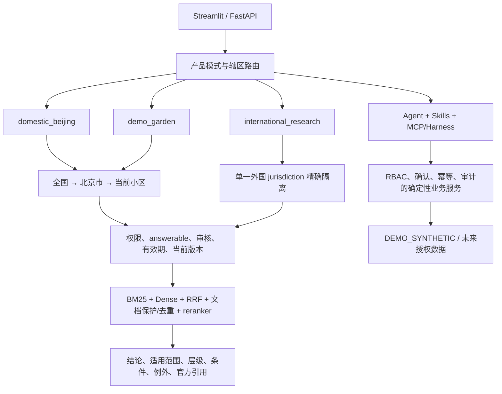

# 智邻管家北京物业智能体完整解决方案

版本日期：2026-08-10  
定位：北京国内物业业务为主，国际比较研究为辅  
交付状态：本地 Demo/研究范围统一验收 PASS；非生产系统

## 一、解决方案概览

智邻管家在保留既有物业业务闭环的基础上，新增产品模式、国内适用链、官方来源治理、合成业务层和可复现门禁。核心不是把外国 Demo 换一套文案，而是在检索前建立互斥的数据和辖区边界：



## 二、产品与辖区路由

### `domestic_beijing`

默认模式。全国问题只检索全国资料；明确北京的问题检索全国 + 北京市；存在受信任的当前小区上下文时可再加入该小区合同、管理规约、收费标准和应急制度。无城市且问题依赖地方规则时要求补充城市；北京与上海、北京与外国或多个外国混问时拒答。

### `international_research`

必须显式选择 GB、AU-NSW、AU-VIC、NZ、US-NY-NYC、SG 或 GLOBAL 中的一个精确辖区。外国资料只作比较和流程借鉴，回答会提示其不构成北京依据。

### `demo_garden`

用于 Demo Garden 合成社区。可读取全国、北京和精确社区制度，也可展示合成账单、工单、投诉、巡检和设备业务。所有数据和引用都标明合成/社区层性质。

## 三、法律适用与回答契约

国内三层依次为国家法律法规和部委规定、北京市法规规章标准和办事指南、当前小区合同规约与制度。来源冲突按权威层级排序，上位法优先；社区制度违反国家或北京规定时不能作为处理依据。

每次有证据的回答包含：直接结论、适用地域、适用时间和版本、法律/地方标准/合同层级、条件与例外、原始官方 URL、章节/条款/页码。合同和规约会明确限定到相应小区。

以下情况在回答前拒绝或要求补充：地方敏感事项无城市；多个城市/国家混用；只剩失效来源；外国资料被要求支持北京结论；具体赔偿、减费、改账或法律责任承诺；知识库没有直接有效证据；越权或提示词注入；查询“其他小区”但未明确并授权目标社区。

## 四、官方知识流水线

`scripts/sync_beijing_knowledge.py` 管理 52 项高相关本阶段候选，只允许精确 HTTPS 官方主机。下载逐跳验证重定向和最终主机，检查 MIME、PDF/HTML 签名、300 B–30 MB 大小并计算 SHA-256。每项生成独立 manifest；注册表与文件/manifest 不一致时来源门禁失败。

统一注册表包含用户要求的全部元数据字段。只有 `answerable=true`、`review_status=approved`、版本/效力可确认且文件治理通过的来源进入当前回答索引。当前全国 + 北京市链为 56 项，54 项可回答，2 项 pending。完整目录见 [95_beijing_official_knowledge_catalog.md](95_beijing_official_knowledge_catalog.md)。

国际官方来源和既有公开数据没有删除，但物理目录、元数据和查询模式均与国内默认回答隔离。

## 五、三层数据架构

- `KB_POLICY`：54 项当前可回答的全国/北京官方来源构成北京适用链；未来社区制度另按精确社区和授权管理。
- `OPS_PUBLIC`：12345 年度统计等聚合材料只支持类别和季节趋势研究，不进入个案事实或规范回答。
- `DEMO_SYNTHETIC`：6,000 条合成记录覆盖 546 天、10 类物业业务；另有 6 份 Demo Garden 合成制度用于社区层演示。

合成集的固定种子、SHA-256、类型分布和禁止声明见 [96_beijing_data_card.md](96_beijing_data_card.md)。未来真实数据必须先获得书面授权并与 Demo 分区。

## 六、RAG 实现

`rag/service.py` 在 BM25/Dense 之前完成角色/社区权限、模式、辖区、回答许可、审核状态、生效/失效时间和当前版本过滤。候选融合保留 BM25、Dense、RRF、每文档代表候选、文档级去重和可选 HTTP reranker。离线 hash Dense 只对已授权 BM25 候选计算，避免绕过前置边界。

引用输出携带产品模式、国家/辖区、适用层、权威层级和排序、版本、有效期、来源 URL、章节、条款、页码、来源类型和数据类。查询日志保存解析后的模式/辖区、过滤上下文、引用数量、质量配置、延迟和拒答错误码。

当前没有模型服务，因此 `semantic_embedding=false`、`external_reranker=false`、`formal_quality_claim_allowed=false`。设置真实 embedding 和 HTTP/API reranker 后需要重新索引与重评，不能沿用 fallback 成绩。

## 七、Agent 与业务能力

Agent 支持报修、本人账单、投诉、房屋、巡检、整改、设备、公告草稿和知识问答路由。全国/北京/小区/国际范围随工具调用传递；本人业务数据只来自 Demo 或未来明确授权分区。

原有完整业务功能继续保留：报修受理和 SLA 生命周期、人工派单、公告草稿/审核/发布、模拟账单查询和复核、巡检异常与整改、设备台账、通知中心、Dashboard、Outbox、审计和 MCP/Harness。

写操作由确定性服务执行，受 RBAC、结构化参数、显式确认、幂等和审计保护。Agent 工具面不包含自动发布公告、减免费用、修改账单或法律责任认定。

## 八、接口与前端

- Agent 输入接受 `product_mode` 和 `jurisdiction`，响应返回解析结果和引用模式。
- `GET /api/v1/product-context` 返回默认模式、默认北京辖区和三层适用范围。
- RAG API 返回 `product_mode`、解析辖区、`answer_status`、`error_code`、质量配置和完整 citations。
- Streamlit 侧栏可选择三种模式；国际模式提示只作研究，Demo 模式提示数据合成，北京模式显示适用链。
- 官方上传激活/审批需要与受治理来源注册表、URL 和 checksum 一致；普通上传不能伪装成官方可回答来源。

## 九、迁移、索引和运行

数据库迁移 head 为 `20260810_domestic_beijing_modes`，增加数据类、产品模式和解析辖区等字段。`alembic/env.py` 支持从项目根执行。知识索引使用独立的 `chroma_beijing_v1` 路径，保留旧国际索引目录作为历史资产。

推荐重建顺序：

```powershell
python -m pip install -e ".[dev]"
python -m alembic upgrade head
python -m data.seed
python scripts/sync_beijing_knowledge.py
python scripts/verify_source_registry.py
python scripts/import_knowledge.py --reindex-all
python scripts/generate_beijing_synthetic_ops.py
python scripts/run_complete_acceptance.py --security
```

## 十、验证证据

最终统一验收八项子检查全部 PASS：来源治理 82 项无错误/警告；Alembic 无待生成变更；pytest 63/63；Agent 95 条分类回归全通过；北京 360/360；权限/辖区泄漏均为 0；RAG 达到全部离线数值门槛；合成数据门和安全扫描通过。

详细结果见 [100_beijing_final_acceptance.md](100_beijing_final_acceptance.md)、[97_beijing_rag_evaluation_report.md](97_beijing_rag_evaluation_report.md)、[98_beijing_agent_evaluation_report.md](98_beijing_agent_evaluation_report.md)和[99_beijing_security_report.md](99_beijing_security_report.md)。

## 十一、交付边界

该交付已形成可运行、可复现、来源受控、辖区隔离的北京物业智能体 Demo/研究系统。它尚不具备真实物业数据授权、正式多语种模型质量、独立人工金标、生产高可用、最新 Trivy 在线库验证或第三方安全认证。具体未完成项、不能宣称能力和资源需求以最终验收报告为准。
