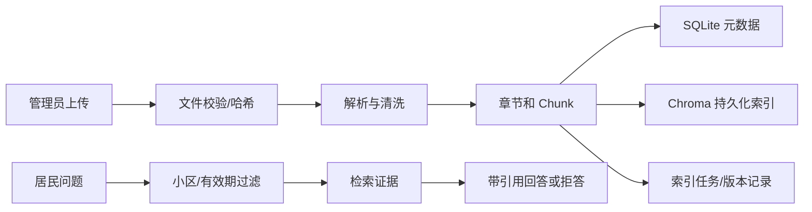

# 阶段 2 架构

```mermaid
flowchart LR
  U[管理员上传] --> V[文件校验/哈希]
  V --> P[解析与清洗]
  P --> C[章节和 Chunk]
  C --> S[SQLite 元数据]
  C --> X[Chroma 持久化索引]
  C --> J[索引任务/版本记录]
  R[居民问题] --> F[小区/有效期过滤]
  F --> Q[检索证据]
  Q --> A[带引用回答或拒答]
```

Chroma 是就绪检查的必需依赖，索引与源文件均持久化于 `data`。未配置模型密钥时使用确定性哈希嵌入和关键词混合排序；生产可替换为兼容 OpenAI `/embeddings` 的真实嵌入服务。可选 LLM 也仅在已取回证据上下文中生成答案，调用失败自动退回检索式引用答案。
