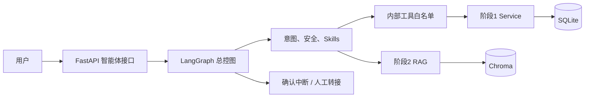

# 阶段 3 架构

```mermaid
flowchart LR
  U[用户] --> A[FastAPI 智能体接口]
  A --> G[LangGraph 总控图]
  G --> S[意图、安全、Skills]
  S --> R[阶段2 RAG]
  S --> T[内部工具白名单]
  T --> B[阶段1 Service]
  B --> D[(SQLite)]
  R --> C[(Chroma)]
  G --> H[确认中断 / 人工转接]
```

LangGraph 只编排流程，不直接绕过权限。工具适配层直接调用阶段 1 的 Service/模型层，RAG 直接调用阶段 2 `search`。确认前没有写入业务记录；确认恢复时使用同一 `thread_id` 和持久化 SQLite checkpointer。
