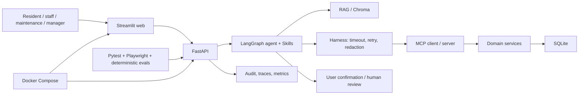

# Stage 5 integration architecture

The diagram is intentionally limited to components in this repository. All state-changing tool paths remain subject to authorization, confirmation/idempotency and audit controls.
